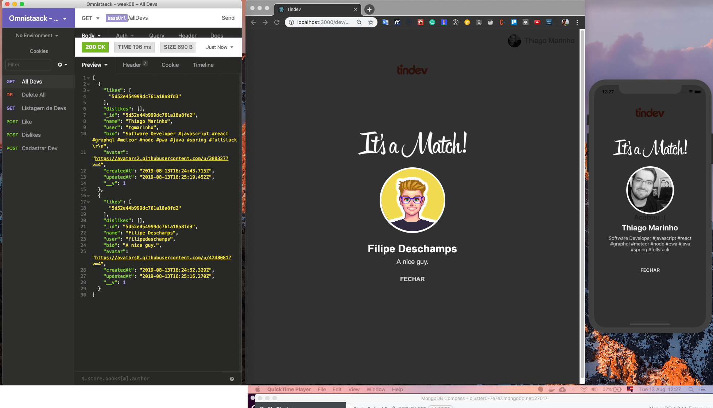

# TinDev - Its A Match

## Omnistack
Is a event online promoted by RocketSeat.

## Technologies / Stack
Javascript, Node, Cloud/Compass MongoDB, React, Socket.io, React Native, Axios, Express, CSS, HTML, Flexbox...

## Features

- [x] Add git hub users
- [x] Like user
- [x] Dislike user
- [x] Show a message simultaneously when the users is a matched

## Check it out

#### Click on the image to redirect to [Youtube](https://www.youtube.com/watch?v=W9r3-v8KATg&feature=youtu.be):

## How to Run

1. Clone repo and go to `cd backend` and `cd frontend` and `cd tindev`
2. Install yarn `install -g yarn`
   
3. Install the dependencies with `yarn install`.
4. Run your application with `yarn start` in each project.

